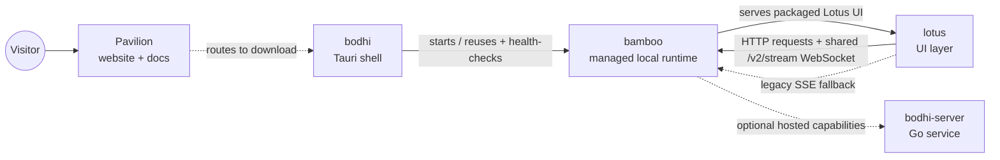

# Pavilion · Official Website & Docs Surface

> 📖 中文版请看 **[README.zh-CN.md](./README.zh-CN.md)**

> Pavilion is where the Zenith stack tells its story to the outside world — the official website that explains Bodhi AI, the desktop agent, in plain language: what it does, why it matters, where to download it, and how to get started.

---

## HOOK

Imagine an assistant that lives on your own computer: you hand it a goal, it breaks the work down, gets it done, shows you every step as it happens, and turns repeated chores into automation that runs itself next time. Pavilion is the website that explains all of this to a first-time visitor — no jargon, just "here's what it can do for you."

Pavilion itself is **not** the runtime and **not** the desktop app — it is the product's front door: home, download, docs, and long-form articles.

---

## Key Capabilities at a Glance

| Capability | What it is |
|---|---|
| Four product surfaces | Home, Features, Download, and Docs, all driven by React Router client-side routing |
| Bilingual by design | One-click 中文 / English switch, remembers the preference and writes it into the URL (`?lang=zh`) |
| Real screenshots | Actual UI in `public/screenshots/` (chat, MCP, metrics, settings, etc.), not concept art |
| Article layer | Founder story, architecture overview, backend deep-dive, CI/CD, multi-agent collaboration |
| Static & shippable | Built by Vite into a pure static site, ready to host out of the box |
| Source-visible examples | Quickstart and API snippets are kept in `src/constants.ts` instead of being hidden in page components |

---

## Architecture

Pavilion is a plain React 19 + Vite 8 single-page app written in TypeScript. It has no backend of its own: the site copy lives in bilingual content dictionaries under `src/i18n/`, and the pages simply render it. Within Zenith's nine pinned submodules, Pavilion owns one boundary — the public website and documentation surface.

```
pavilion/
├── index.html              # SEO + Open Graph / Twitter meta
├── src/
│   ├── main.tsx            # entry
│   ├── App.tsx             # react-router route table (/ /features /download /docs)
│   ├── pages/              # HomePage / FeaturesPage / DownloadPage / DocsPage
│   ├── components/         # LanguageSwitch / SmartLink / RevealSection / SectionIntro
│   ├── hooks/useReveal.ts  # scroll-reveal
│   ├── i18n/               # zh.ts + en.ts bilingual content dictionaries
│   ├── utils/locale.ts     # locale detection & URL building
│   ├── constants.ts        # GitHub links, quickstart / API code examples
│   └── test/               # Vitest + Testing Library
├── articles/               # long-form Markdown
└── public/                 # favicon, og-cover, screenshots/
```

The core product path that Pavilion explains:



> This is the product/request path, not a complete submodule diagram. Bodhi starts or reuses `bamboo serve` and checks its health. In packaged builds, Bodhi loads the Lotus frontend served by Bamboo. Lotus sends requests over HTTP and receives live events through one shared `/v2/stream` WebSocket by default (JSON text by default, optional negotiated MessagePack). The legacy SSE endpoints are used only when WebSocket is explicitly disabled or its initial connection cannot be established. bodhi-server is an optional hosted service for account/auth, credential storage, model routing, billing/quota, and provider proxy capabilities; local Bodhi + Bamboo operation does not require it. Pavilion itself only links to the other repositories; it does not call the runtime or backend.

---

## Signature Deep-Dives

### The external narrative across four pages

Every surface reinforces one message: *Bodhi AI is a desktop agent that actually does the work.* The Home hero pairs a tagline with a live execution timeline; Features expands each capability with a table of contents; Download routes visitors straight to Bodhi's GitHub Releases; Docs carries first-run, power-user, architecture, API, and contributor tracks. All four are rendered from the bilingual dictionaries in `src/i18n/` — copy is data, not hard-coded JSX. Unknown routes fall back to Home.

### Bilingual-first

Language is built into the architecture, not bolted on. `locale.ts` resolves the initial locale in order: the `?lang=` query param → `localStorage` (key `pavilion-locale`) → browser language (`zh*` → Chinese, else English). Switching language persists the choice and writes it back into the URL so links stay shareable. `LanguageSwitch` is a simple 中文 / EN toggle present on every page.

### The article layer

`articles/` holds the long-form narrative and technical deep-dives (Markdown, primarily Chinese):

| Article | What it covers |
|---|---|
| [`why-i-built-my-own-agent.md`](./articles/why-i-built-my-own-agent.md) | Why the founder decided to build an agent from scratch — the product's origin story |
| [`zenith-architecture-overview.md`](./articles/zenith-architecture-overview.md) | Long-form narrative about Zenith's product layers and responsibility boundaries |
| [`bodhi-server-deep-dive.md`](./articles/bodhi-server-deep-dive.md) | Optional hosted accounts, credential vault, billing/quota, model routing, and provider proxy capabilities in the Go backend |
| [`ci-cd-and-release-system.md`](./articles/ci-cd-and-release-system.md) | The coordinated Bamboo / Lotus / Bodhi release pipeline built on GitHub Actions |
| [`multi-agent-collaboration.md`](./articles/multi-agent-collaboration.md) | Coordinating multiple agents working in parallel via the "Zenith Roadmap" GitHub Project |

---

## Quick Start / Development

Only scripts **verified to exist** in `package.json` are listed.

```bash
cd pavilion
npm install

npm run dev       # start the Vite dev server
npm run build     # typecheck (tsc -b) + production build
npm run preview   # preview the built site
npm run lint      # ESLint
npm run test      # Vitest (vitest run)
```

Stack: React 19 · React Router 7 · Vite 8 · TypeScript 5.9 · Vitest 4 (see `package.json` for details).

---

## The Rest of the Stack

Zenith is a thin monorepo that currently pins nine submodules; Pavilion is its public-facing front door.

| Module | Role |
|---|---|
| [**bodhi**](https://github.com/bigduu/Bodhi-AI) | Tauri desktop shell that starts or reuses and health-checks Bamboo; packaged builds load the Lotus UI served by Bamboo |
| [**lotus**](https://github.com/bigduu/Lotus) | the visible UI layer (React + Vite) |
| [**bamboo**](https://github.com/bigduu/Bamboo-agent) | local-first Rust agent runtime (execution engine) |
| [**bodhi-server**](https://github.com/bigduu/bodhi-server) | optional hosted service for account/auth, credential storage, model routing, billing/quota, and provider proxy capabilities; not required for local Bodhi + Bamboo operation |
| **pavilion** | official website & docs (this module) |
| [**jiandu**](https://github.com/bigduu/Jiandu) | small filesystem-backed shared memory: Rust crate + stdio MCP server |
| [**nova**](https://github.com/bigduu/Nova) | native computer-use capabilities exposed through MCP |
| [**lotus-next**](https://github.com/bigduu/lotus-next) | responsive frontend track developed alongside Lotus |
| [**magpie**](https://github.com/bigduu/Magpie) | IM connector and Bamboo service plugin |
| [**Zenith (root)**](https://github.com/bigduu/Zenith) | monorepo entry + submodule pointers + release train |

Download entry: https://github.com/bigduu/Bodhi-AI/releases/latest

---

<sub>This root guide describes the repository; public site copy lives in `src/i18n/` and `articles/`.</sub>
