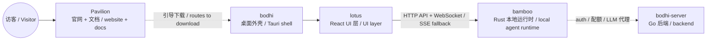

# Pavilion · Zenith 官方网站与文档门户

> 📖 For English, see **[README.md](./README.md)**

> Pavilion 是 Zenith AI 技术栈对外讲故事的地方——一个面向所有访客的官方网站，把 Bodhi AI 这款桌面智能体讲清楚：它能做什么、为什么值得用、怎么下载、怎么上手。

---

## HOOK

想象一个住在你电脑里的助手：你交给它一个目标，它会自己拆解任务、动手执行、把每一步实时展示给你看，并且能把重复的工作变成下次自动运行的流程。Pavilion 就是把这件事讲给第一次听说的人的网站——没有术语，只有「它能帮你做什么」。

Pavilion 本身**不是**运行时，也不是桌面应用——它是产品的门面：首页、下载页、文档与文章。

---

## 核心能力一览

| 能力 | 说明 |
|---|---|
| 四个产品页面 | 首页 Home、功能 Features、下载 Download、文档 Docs，全部由 React Router 客户端路由驱动 |
| 双语切换 | 中文 / English 一键切换，记忆偏好并写入 URL（`?lang=zh`） |
| 真实产品截图 | `public/screenshots/` 中的实际界面（对话、MCP、指标、设置等），而非概念图 |
| 长文叙事层 | 创始人故事、架构总览、后端深解、CI/CD、多 Agent 协作 |
| 静态可托管 | Vite 构建为纯静态站点，开箱即托管 |
| 示例集中可见 | Quickstart 与 API 片段集中放在 `src/constants.ts`，没有藏在页面组件里 |

---

## 架构

Pavilion 是一个标准的 React 19 + Vite 8 单页应用（SPA），用 TypeScript 编写。它没有自己的后端：网站文案来自 `src/i18n/` 下的双语内容字典，页面负责渲染。Zenith 当前固定了九个 submodule，Pavilion 在其中只承担官网与文档这一条对外边界。

```
pavilion/
├── index.html              # SEO + Open Graph / Twitter meta
├── src/
│   ├── main.tsx            # 入口
│   ├── App.tsx             # react-router 路由表 (/ /features /download /docs)
│   ├── pages/              # HomePage / FeaturesPage / DownloadPage / DocsPage
│   ├── components/         # LanguageSwitch / SmartLink / RevealSection / SectionIntro
│   ├── hooks/useReveal.ts  # 滚动进入动画
│   ├── i18n/               # zh.ts + en.ts 双语内容字典
│   ├── utils/locale.ts     # 语言探测与 URL 构建
│   ├── constants.ts        # GitHub 链接、quickstart / API 代码示例
│   └── test/               # Vitest + Testing Library
├── articles/               # 长文 Markdown
└── public/                 # favicon, og-cover, screenshots/
```

Pavilion 所解释的核心产品链路：



> 这张图只表示产品与请求链路，不是完整的 submodule 图。Lotus 默认使用共享的 `/v2/stream` WebSocket（默认 JSON 文本，也可显式协商 MessagePack）；首次 WebSocket 建连失败时回退到 SSE。Pavilion 本身只链接到其它仓库，不调用运行时或后端。

---

## 招牌能力

### 外部叙事：四个页面讲一个故事

整个网站围绕「Bodhi AI 是会动手的桌面智能体」这条主线展开：

- **首页 Home (`/`)** — Hero 标语「Desktop AI that does more than chat / 不止于聊天的桌面 AI」，配一条实时执行时间线（接收目标 → 生成计划 → MCP 执行 → 交给自动化）、亮点（真正执行、默认可见、随时间复利）、产品截图、能力卡片、FAQ。
- **功能页 Features (`/features`)** — 每项能力的细致拆解，带目录导航。
- **下载页 Download (`/download`)** — 指向 Bodhi 的 GitHub Releases，最新版本入口与首跑引导。
- **文档页 Docs (`/docs`)** — 首跑、进阶（Provider / MCP / Workflow / Schedule）、架构、API、Bodhi Server 集成、CI/CD、多 Agent、安全等。

### 双语优先

语言不是事后补丁，而是架构的一部分。`src/utils/locale.ts` 按以下优先级决定初始语言：URL 的 `?lang=` 参数 → `localStorage`（键名 `pavilion-locale`）→ 浏览器语言（`zh*` 走中文，否则英文）。切换语言后，偏好会写回 localStorage 并同步进 URL，便于分享。

### 文章层：把「为什么」讲透

`articles/` 下是更长的叙事与技术深解（Markdown，以中文为主）：

| 文章 | 内容 |
|---|---|
| [`why-i-built-my-own-agent.md`](./articles/why-i-built-my-own-agent.md) | 创始人为什么决定自己写一个 Agent — 产品起源叙事 |
| [`zenith-architecture-overview.md`](./articles/zenith-architecture-overview.md) | Zenith 产品层次与职责边界的长文叙事 |
| [`bodhi-server-deep-dive.md`](./articles/bodhi-server-deep-dive.md) | Go 后端 Bodhi Server 的服务端能力（认证、持久化、跨设备同步）深解 |
| [`ci-cd-and-release-system.md`](./articles/ci-cd-and-release-system.md) | 基于 GitHub Actions 的 Bamboo / Lotus / Bodhi 协同发布流程 |
| [`multi-agent-collaboration.md`](./articles/multi-agent-collaboration.md) | 用 GitHub Projects「Zenith Roadmap」协调多个 agent 并行工作 |

---

## 快速开始 / 开发

仅列出在 `package.json` 中**已验证存在**的脚本。

```bash
cd pavilion
npm install

npm run dev       # 启动 Vite 开发服务器
npm run build     # 类型检查 (tsc -b) + 生产构建
npm run preview   # 本地预览构建产物
npm run lint      # ESLint
npm run test      # Vitest (vitest run)
```

技术栈：React 19 · React Router 7 · Vite 8 · TypeScript 5.9 · Vitest 4（详见 `package.json`）。

---

## 其余模块

Zenith 是一个当前固定九个 submodule 的薄层 monorepo，Pavilion 是其中的对外门面。

| 模块 | 角色 |
|---|---|
| [**bodhi**](https://github.com/bigduu/Bodhi-AI) | 桌面 AI 产品外壳（Tauri） |
| [**lotus**](https://github.com/bigduu/Lotus) | React + Vite UI 层 |
| [**bamboo**](https://github.com/bigduu/Bamboo-agent) | 本地优先的 Rust 智能体运行时（执行引擎） |
| [**bodhi-server**](https://github.com/bigduu/bodhi-server) | Go 后端：认证、持久化、配额与 LLM 代理等服务端能力 |
| **pavilion** | 官网与文档（本模块） |
| [**jiandu**](https://github.com/bigduu/Jiandu) | 小型文件系统共享记忆：Rust crate + stdio MCP server |
| [**nova**](https://github.com/bigduu/Nova) | 通过 MCP 暴露原生电脑操作能力 |
| [**lotus-next**](https://github.com/bigduu/lotus-next) | 与 Lotus 并行开发的响应式前端路线 |
| [**magpie**](https://github.com/bigduu/Magpie) | IM 连接器与 Bamboo service plugin |
| [**Zenith (root)**](https://github.com/bigduu/Zenith) | monorepo 入口 + submodule 指针 + 发布列车 |

下载入口：https://github.com/bigduu/Bodhi-AI/releases/latest

---

<sub>这份根指南描述 Pavilion 仓库；公开网站文案位于 `src/i18n/` 与 `articles/`。</sub>
