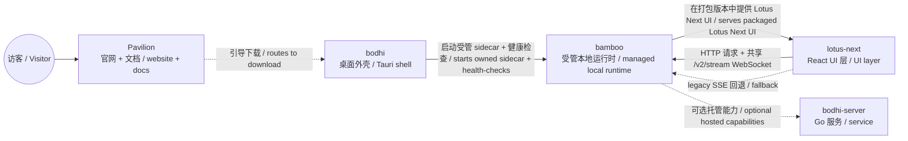

# Pavilion · Zenith 官方网站与文档门户

> 📖 For English, see **[README.md](./README.md)**

> Pavilion 是 Zenith AI 技术栈对外讲故事的地方——一个面向所有访客的官方网站，把 Bodhi AI 这款桌面智能体讲清楚：它能做什么、为什么值得用、怎么下载、怎么上手。

---

## 从哪里开始

想了解本地 AI agent harness 如何使用？Pavilion 把产品介绍、下载入口和上手文档放在一起。想运行智能体，请从 [Bodhi 下载页](https://github.com/bigduu/Bodhi-AI/releases/latest) 或 [Bamboo](https://github.com/bigduu/Bamboo-agent) 开始；本仓库适合维护网站文案、检查双语内容和本地预览文档。

下面描述已核对的源码页面与构建方式，不代表网站示例已完成真实任务，也不证明线上部署或各产品最新发布版本包含所有功能。首页执行时间线是说明性界面，不能当作实时任务录屏。

下方 Zenith 架构描述当前产品源码。Pavilion 的 `src/constants.ts` 上手示例和 `src/i18n/` 双语页面仍引用旧版 Lotus，并将 Lotus Next 描述为并行开发方向。所链接的[架构长文](./articles/zenith-architecture-overview.md)也已明确标注为历史笔记，其中九模块计数及 Lotus/Next 并行描述属于旧时期。这次 README 更新没有迁移网站页面。当前源码的安装与启动请遵循 [Lotus Next](https://github.com/bigduu/lotus-next)、[Bamboo](https://github.com/bigduu/Bamboo-agent) 和 [Bodhi](https://github.com/bigduu/Bodhi-AI) 仓库指南。

---

## 核心能力一览

| 能力 | 说明 |
|---|---|
| 四个产品页面 | 首页 Home、功能 Features、下载 Download、文档 Docs，全部由 React Router 客户端路由驱动 |
| 双语切换 | 中文 / English 一键切换，记忆偏好并写入 URL（`?lang=zh`） |
| 真实产品截图 | `public/screenshots/` 中的实际界面（对话、MCP、指标、设置等），而非概念图 |
| 长文叙事层 | 创始人故事、架构总览、后端深解、CI/CD、多 Agent 协作 |
| 静态可托管 | Vite 构建为纯静态站点，开箱即托管 |
| 示例集中可见 | Quickstart 与 API 片段集中放在 `src/constants.ts`，没有藏在页面组件里 |

---

## 架构

Pavilion 是一个标准的 React 19 + Vite 8 单页应用（SPA），用 TypeScript 编写。它没有自己的后端：网站文案来自 `src/i18n/` 下的双语内容字典，页面负责渲染。Zenith 当前固定了八个 submodule，Pavilion 在其中只承担官网与文档这一条对外边界。

```
pavilion/
├── index.html              # SEO + Open Graph / Twitter meta
├── src/
│   ├── main.tsx            # 入口
│   ├── App.tsx             # react-router 路由表 (/ /features /download /docs)
│   ├── pages/              # HomePage / FeaturesPage / DownloadPage / DocsPage
│   ├── components/         # LanguageSwitch / SmartLink / RevealSection / SectionIntro
│   ├── hooks/useReveal.ts  # 滚动进入动画
│   ├── i18n/               # zh.ts + en.ts 双语内容字典
│   ├── utils/locale.ts     # 语言探测与 URL 构建
│   ├── constants.ts        # GitHub 链接、quickstart / API 代码示例
│   └── test/               # Vitest + Testing Library
├── articles/               # 长文 Markdown
└── public/                 # favicon, og-cover, screenshots/
```

当前 Zenith 产品架构：


```mermaid
flowchart LR
  Visitor((访客 / Visitor)) --> Pavilion[Pavilion\n官网 + 文档 / website + docs]
  Pavilion -. 引导下载 / routes to download .-> Bodhi[bodhi\n桌面外壳 / Tauri shell]
  Bodhi -- 启动受管 sidecar + 健康检查 / starts owned sidecar + health-checks --> Bamboo[bamboo\n受管本地运行时 / managed local runtime]
  Bamboo -- 在打包版本中提供 Lotus Next UI / serves packaged Lotus Next UI --> Lotus[lotus-next\nReact UI 层 / UI layer]
  Lotus -- HTTP 请求 + 共享 /v2/stream WebSocket --> Bamboo
  Lotus -. legacy SSE 回退 / fallback .-> Bamboo
  Bamboo -. 可选托管能力 / optional hosted capabilities .-> BodhiServer[bodhi-server\nGo 服务 / service]
```

> 这张图只表示产品与请求链路，不是完整的 submodule 图。Bodhi 启动并健康检查自己管理的 `bamboo serve` sidecar；只有显式选择旧版回滚路径时才复用外部服务。在打包版本中，Bodhi 加载由 Bamboo 提供的 Lotus Next 前端。Lotus Next 通过 HTTP 发送请求，实时事件默认走一个共享的 `/v2/stream` WebSocket（默认 JSON 文本，也可显式协商 MessagePack）；只有显式禁用 WebSocket 或首次连接无法建立时才使用 legacy SSE 端点。bodhi-server 是可选托管服务，提供账号与认证、凭据存储、模型路由、计费与配额以及 provider 代理能力；本地 Bodhi + Bamboo 运行不依赖它。Pavilion 本身只链接到其它仓库，不调用运行时或后端。

---

## 招牌能力

### 外部叙事：四个页面讲一个故事

整个网站围绕「Bodhi AI 是会动手的桌面智能体」这条主线展开：

- **首页 Home (`/`)** — Hero 标语「Desktop AI that does more than chat / 不止于聊天的桌面 AI」，配一条说明性执行时间线（接收目标 → 生成计划 → MCP 执行 → 交给自动化）、亮点（真正执行、默认可见、随时间复利）、产品截图、能力卡片、FAQ。
- **功能页 Features (`/features`)** — 每项能力的细致拆解，带目录导航。
- **下载页 Download (`/download`)** — 指向 Bodhi 的 GitHub Releases，最新版本入口与首跑引导。
- **文档页 Docs (`/docs`)** — 首跑、进阶（Provider / MCP / Workflow / Schedule）、架构、API、Bodhi Server 集成、CI/CD、多 Agent、安全等。

### 双语优先

语言不是事后补丁，而是架构的一部分。`src/utils/locale.ts` 按以下优先级决定初始语言：URL 的 `?lang=` 参数 → `localStorage`（键名 `pavilion-locale`）→ 浏览器语言（`zh*` 走中文，否则英文）。切换语言后，偏好会写回 localStorage 并同步进 URL，便于分享。

### 文章层：把「为什么」讲透

`articles/` 下是更长的叙事与技术深解（Markdown，以中文为主）：

| 文章 | 内容 |
|---|---|
| [`why-i-built-my-own-agent.md`](./articles/why-i-built-my-own-agent.md) | 创始人为什么决定自己写一个 Agent — 产品起源叙事 |
| [`zenith-architecture-overview.md`](./articles/zenith-architecture-overview.md) | 旧版 Lotus / Lotus Next 并行时期的产品层次与职责边界，属于历史笔记 |
| [`bodhi-server-deep-dive.md`](./articles/bodhi-server-deep-dive.md) | 可选 Go 托管服务的账号认证、凭据保险箱、计费配额、模型路由与 provider 代理能力 |
| [`ci-cd-and-release-system.md`](./articles/ci-cd-and-release-system.md) | 基于 GitHub Actions 的 Bamboo / Lotus / Bodhi 协同发布流程 |
| [`multi-agent-collaboration.md`](./articles/multi-agent-collaboration.md) | 用 GitHub Projects「Zenith Roadmap」协调多个 agent 并行工作 |

---

## 快速开始 / 开发

需要 Node.js 22.13 及以上的 22.x 版本，或 Node.js 24 及以上版本，以及 npm；该范围满足已锁定 jsdom 依赖的引擎要求。以下脚本在 `package.json` 中定义。

```bash
git clone https://github.com/bigduu/Pavilion.git
cd Pavilion
npm ci

npm run dev       # 启动 Vite 开发服务器
npm run build     # 类型检查 (tsc -b) + 生产构建
npm run preview   # 本地预览构建产物
npm run lint      # ESLint
npm run test      # Vitest (vitest run)
```

技术栈：React 19 · React Router 7 · Vite 8 · TypeScript 5.9 · Vitest 4（详见 `package.json`）。

---

## 其余模块

Zenith 是一个当前固定八个 submodule 的薄层 monorepo，Pavilion 是其中的对外门面。

| 模块 | 角色 |
|---|---|
| [**bodhi**](https://github.com/bigduu/Bodhi-AI) | Tauri 桌面外壳，负责启动自己管理的 Bamboo sidecar 并执行健康检查；打包版本加载由 Bamboo 提供的 Lotus Next UI |
| [**bamboo**](https://github.com/bigduu/Bamboo-agent) | 本地优先的 Rust 智能体运行时（执行引擎） |
| [**bodhi-server**](https://github.com/bigduu/bodhi-server) | 可选托管服务：账号与认证、凭据存储、模型路由、计费与配额以及 provider 代理；本地 Bodhi + Bamboo 运行不需要它 |
| **pavilion** | 官网与文档（本模块） |
| [**jiandu**](https://github.com/bigduu/Jiandu) | 小型文件系统共享记忆：Rust crate + stdio MCP server |
| [**nova**](https://github.com/bigduu/Nova) | 通过 MCP 暴露原生电脑操作能力 |
| [**lotus-next**](https://github.com/bigduu/lotus-next) | 当前响应式 React 前端；旧 Lotus 包仅保留为发布回滚选项 |
| [**magpie**](https://github.com/bigduu/Magpie) | IM 连接器与 Bamboo service plugin |
| [**Zenith (root)**](https://github.com/bigduu/Zenith) | monorepo 入口 + submodule 指针 + 发布列车 |

下载入口：https://github.com/bigduu/Bodhi-AI/releases/latest

---

<sub>这份根指南描述 Pavilion 仓库；公开网站文案位于 `src/i18n/` 与 `articles/`。</sub>

静态托管需把 `/features`、`/download`、`/docs` 等客户端路由回退到 `index.html`。历史文章和截图提供背景，产品版本与安装步骤以各仓库的发布说明为准。

源码与版本核对：[审查记录](./docs/readme-audit.md)。
