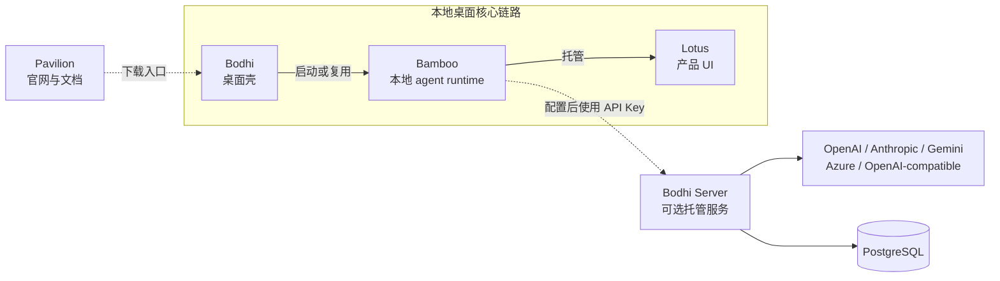

# Bodhi Server：可选的托管账号与模型网关

Bodhi Server 是 Zenith 生态中的独立 Go 服务。它为需要中心化账号、凭据、配额、计费和模型代理的部署提供托管能力，但不是本地桌面产品的必经组件。

> **先看边界：** 本地桌面核心链路是 Bodhi 启动或复用 Bamboo，再由 Bamboo 托管 Lotus。没有配置 Bodhi Server 时，这条链路仍然成立。

---

## 在 Zenith 中的位置



| 组件 | 当前职责 |
| --- | --- |
| Bodhi | 桌面壳；启动或复用 Bamboo，并打开 Bamboo 托管的 Lotus |
| Lotus | 面向用户的 UI，通过 HTTP 与 WebSocket（首次连接失败时回退 SSE）访问 Bamboo |
| Bamboo | 本地 agent runtime、工具执行与 Lotus 宿主 |
| Bodhi Server | 可选的账号、凭据、配额、计费、模型路由和 provider 代理服务 |
| Jiandu | 独立的共享 memory crate 与 stdio MCP server；不属于 Bodhi Server |

Bodhi Server **不是** Bamboo 的本地 API、Lotus 的宿主、Jiandu 的存储层，
也不是通用聊天历史或跨设备同步后端。当前 bodhi-server 路由和数据库
schema 没有定义这类产品职责。

---

## 代码已经实现的能力

### 1. 账号与访问凭据

- `/api/v1/auth/*` 提供注册、登录、刷新令牌和当前用户查询。
- 人类用户通过 JWT 访问用户或管理员 API。
- 程序调用使用 `bhi_sk_` API Key；数据库只保存 Key 哈希，明文只在创建或轮换时返回。
- API Key 可限制允许的模型、provider 和来源 IP。

### 2. Provider 凭据保险箱

- OpenAI、Anthropic、Gemini 等 provider 密钥按用户或用户组保存。
- 密钥使用 AES-256-GCM 加密后写入 PostgreSQL。
- 代理请求在转发前按需读取并解密凭据；列表接口不会返回密钥明文。

### 3. 模型路由与 provider 代理

Bodhi Server 提供四类代理入口：

```text
/proxy/openai/
/proxy/anthropic/
/proxy/gemini/
/proxy/v1/{path...}
```

通用 `/proxy/v1/` 入口可以根据模型注册表选择 provider 与实例。多个实例按
优先级排序，近期失败的实例会被跳过。代理支持 OpenAI、Anthropic、Gemini、
Azure OpenAI 和 OpenAI-compatible 上游，并转发流式与非流式响应。

### 4. 配额、用量与计费

- 请求前检查模型白名单，以及 RPM、RPD、每日/月度 token 和花费上限。
- 请求后记录 provider、模型、token、状态码、耗时和估算成本。
- 用户可查询当月用量、账期报告并导出 CSV；管理员可配置定价、配额和余额。
- 用户组可以共享 provider 凭据与配额。

### 5. 管理与可观测性

- 管理员 API 覆盖用户、模型、provider 实例、配额、定价、组、审计、Webhook、内容规则和数据保留策略。
- `GET /health` 是公开健康检查。
- `GET /metrics` 输出 Prometheus 指标，但受管理员认证保护。
- React 管理面板构建后嵌入 Go 二进制；它是 Bodhi Server 自己的管理 UI，不是 Lotus。

---

## 三条请求路径

### 本地 agent 工作

```text
Bodhi → Bamboo → Lotus
```

这是桌面产品的核心路径。Bamboo 在本地执行 agent 工作并托管 Lotus，不需要经过 Bodhi Server。

### 账号与管理控制面

```text
用户或管理员 → /api/v1/* → JWT 鉴权 → PostgreSQL
```

这条路径处理账号、API Key、加密凭据、模型目录、配额和账单等服务控制数据。

### 托管模型调用

```text
Bamboo 或其他客户端
  → /proxy/*（bhi_sk_ API Key）
  → Key / IP / 模型 / provider / 配额检查
  → 选择实例并注入解密后的 provider 凭据
  → 上游模型
  → 记录用量与成本
```

这条路径只有在客户端明确配置 Bodhi Server 代理时才参与请求。

---

## API 边界速查

| 路由 | 鉴权 | 用途 |
| --- | --- | --- |
| `GET /health` | 无 | 服务健康检查 |
| `GET /metrics` | 管理员 JWT | Prometheus 指标 |
| `/api/v1/auth/*` | 公开或用户 JWT | 注册、登录、刷新、当前用户 |
| `/api/v1/keys*` | 用户 JWT | 创建、列出、删除与轮换程序 API Key |
| `/api/v1/credentials*` | 用户 JWT | 管理加密 provider 凭据 |
| `GET /api/v1/models` | 用户 JWT | 查询可用模型 |
| `/api/v1/billing/*` | 用户 JWT | 当前用量、月度报告与 CSV |
| `/api/v1/admin/*` | 管理员 JWT | 用户、模型、实例、配额、定价与治理 |
| `/proxy/*` | `bhi_sk_` API Key | 路由并代理模型请求 |

PostgreSQL 在这里保存的是服务控制面与网关运行数据，例如账号、Key 哈希、
加密凭据、模型配置、用量、配额、账单和审计记录。把这些数据持久化并不等于
保存 Bamboo 会话、Lotus 历史或 Jiandu memory。

---

## 部署与验证

仓库的 Docker Compose 会启动 PostgreSQL 16 和 Bodhi Server。容器构建先生成管理面板，再把它嵌入 Go 可执行文件。

```bash
export BODHI_ENCRYPTION_KEY=$(openssl rand -hex 32)
export BODHI_JWT_SECRET=$(openssl rand -hex 32)
export BODHI_DB_PASSWORD=change-me

docker compose up --build
curl http://localhost:8080/health
```

`BODHI_ENCRYPTION_KEY` 必须是 32 字节密钥对应的 64 位十六进制字符串。
服务默认监听 `0.0.0.0:8080`；生产环境的公网暴露、TLS 终止和访问策略由
部署层负责。

本地开发所需的完整环境变量和命令以
[bodhi-server README](https://github.com/bigduu/bodhi-server/blob/main/README.md)
为准。

---

## 代码入口

- [HTTP 路由与鉴权边界](https://github.com/bigduu/bodhi-server/blob/main/api/router/router.go)
- [LLM 代理处理](https://github.com/bigduu/bodhi-server/blob/main/internal/proxy/handler.go)
- [模型实例路由](https://github.com/bigduu/bodhi-server/blob/main/internal/proxy/router.go)
- [凭据加密](https://github.com/bigduu/bodhi-server/blob/main/internal/crypto/encryption.go)
- [配额检查](https://github.com/bigduu/bodhi-server/blob/main/internal/quota/checker.go)
- [数据库 schema](https://github.com/bigduu/bodhi-server/blob/main/internal/database/schema.go)
- [Docker Compose](https://github.com/bigduu/bodhi-server/blob/main/docker-compose.yml)
- [Zenith 架构概览](./zenith-architecture-overview.md)
- [CI/CD 与发布系统](./ci-cd-and-release-system.md)
